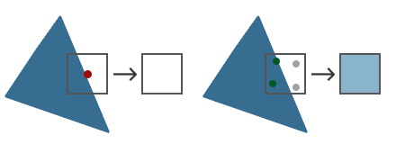

# OpenGL学习笔记（三十一）—— Anti Aliasing

---


## 锯齿
**Aliasing：** 走样（又称为“锯齿”），是指在模型边缘有锯齿的现象，在图形渲染中很常见，如下图：


**Anti-Aliasing：** 反走样(常称“抗锯齿”)，是指要消除模型边缘锯齿的现象，让边缘看起来更加平滑，更真实。

出现锯齿现象是不可避免，是因为渲染物体时，需要将物体模型具体的位置坐标值转换成屏幕某个像素的值；物体模型的顶点坐标是可以任意的，而屏幕的由于像素的限制，只能转换成一定的值。当绘制3D物体的时候，计算物体的边缘位置，如果这个位置把大半个像素包括进去了，显示器会将这个像素设置成3D物体的颜色，如果没有包一半以上，这个像素就会设置成背景色。


## 多重采样
**光栅器：** 是位于最终处理过的顶点之后到片段着色器之前所经过的所有的算法与过程的总和；作用是将一个图元的所有顶点作为输入，并将它转换为一系列的片段。

在光栅化阶段中，顶点坐标可以是任意的，但是片段(像素)不是，受限于分辨率。所以，绝大多数情况下，顶点和片元不会是完美的一一对应关系，所以光栅化的过程会确定图元的边界位置。如下图：


框框内红色或者黑色的点被成为采样点（**注意：采样点不是像素**）。默认情况下，采样点只有一个（单点采样），在片元中心。所以边界只有在包括一半以上的片元时才能将这个片元涂成物体的颜色。图中的三角形光栅化之后的结果如下图所示：


可以很明显地看到，在边上有些像素被设置成红色，有些没有（即使它有一部分是在三角形内的），这样就形成了锯齿。

**多重采样抗锯齿（MSAA,multisample anti-aliasing）：**在一个片元内设置多个采样点（`2` 个、`4` 个或者 `8` 个），根据被包含的采样点数量来确定当前像素的颜色（例如，设置了 `4` 个采样点，如果有两个采样点被包含进去了，则这个像素的颜色就是物体颜色的一半浓度。）。如图：



左边是单点采样，采样点没被包括到三角形之内，则这个像素上不会运行片段着色器，所以是白色；右边是多重采样（`4` 个采样点），有 `2` 个采样点被包含进去了，所以该像素点的颜色就是三角形颜色的一半浓度（即淡蓝色）。

> 采样点的数量可以是任意的，更多的采样点能带来更精确的遮盖率。

`MSAA` 真正的工作方式是，无论三角形遮盖了多少个子采样点，（每个图元中）每个像素只运行一次片段着色器。片段着色器所使用的顶点数据会插值到每个像素的中心，所得到的结果颜色会被储存在每个被遮盖住的子采样点中。当颜色缓冲的子样本被图元的所有颜色填满时，所有的这些颜色将会在每个像素内部平均化。因为上图的4个采样点中只有2个被遮盖住了，这个像素的颜色将会是三角形颜色与其他两个采样点的颜色（在这里是无色）的平均值，最终形成一种淡蓝色。

上面的三角形的使用多重采样如图：


对于三角形的内部的像素，片段着色器只会运行一次，颜色输出会被存储到全部的 `4` 个子样本中。而在三角形的边缘，并不是所有的子采样点都被遮盖，所以片段着色器的结果将只会储存到部分的子样本中。根据被遮盖的子样本的数量，最终的像素颜色将由三角形的颜色与其它子样本中所储存的颜色来决定（即，一个像素中如果有更多的采样点被三角形遮盖，那么这个像素的颜色就会更接近于三角形的颜色。）。

如果给上面的三角形填充颜色，就能得到以下的效果：


## 启用 MSAA
**多重采样缓冲(Multisample Buffer)：** 可以在每个像素中存储特定数量(大于 `1` 个)的多重采样样本(例如，颜色值)缓冲。

- `GLFW` 开启多重采样缓冲：

	``` C
	/* 让 GLFW 提供了一个多重采样(4 个采样样本)缓冲 */
   glfwWindowHint(GLFW_SAMPLES, 4);
	```
- `OpenGL` 开启多重采样缓冲：

	``` C
	/* 启用多重采样 */
    glEnable(GL_MULTISAMPLE);
	```
	
	
## 离屏MSAA
通过 `GLFW` 创建多重采样缓冲并启用 `MSAA` 方式很简单，但如果想要在使用帧缓冲进行离屏渲染，则必须手动创建多重采样缓冲；有两中方式：

- 将多重采样缓冲作为帧缓冲的 **纹理附件**。
- 将多重采样缓冲作为帧缓冲的 **渲染缓冲对象附件**。

### 多重采样纹理附件
使用 `glTexImage2DMultisample(GLenum target, GLsizei samples, GLenum internalformat, GLsizei width, GLsizei height, GLboolean fixedsamplelocations);`  来创建一个支持储存多个采样点的纹理：

- **target：** 纹理类型 target。
- **samples：** 纹理所拥有的样本个数。
- **internalformat：** 纹理内部数据格式。
- **width：** 纹理宽度。
- **height：** 纹理高度。
- **fixedsamplelocations：** 是否对每个纹素使用相同的样本位置以及相同数量的子采样点个数。

``` C
GLuint attachTexture;
glGenTextures(1, &attachTexture);    // 生成纹理
glBindTexture(GL_TEXTURE_2D_MULTISAMPLE, attachTexture);    // 绑定(多重采样)纹理
glTexImage2DMultisample(GL_TEXTURE_2D_MULTISAMPLE, 4, GL_RGB, m_width, m_height, GL_TRUE);  // 创建(多重采样)纹理图像
glFramebufferTexture2D(GL_FRAMEBUFFER, GL_COLOR_ATTACHMENT0, GL_TEXTURE_2D_MULTISAMPLE, attachTexture, 0);   // 将纹理附件添加到帧缓冲上，‘GL_COLOR_ATTACHMENT0’ 作为颜色缓存
glBindTexture(GL_TEXTURE_2D_MULTISAMPLE, 0);    // 解绑纹理（已经分配足够内存的纹理附件，可以将其解绑）
```


### 多重采样渲染缓冲对象附件
使用 `glRenderbufferStorageMultisample(GLenum target, GLsizei samples, GLenum internalformat, GLsizei width, GLsizei height);` 创建一个支持存储多个采样点的渲染缓冲对象：

- **target：** 渲染缓冲对象类型 target。
- **samples：** 渲染缓冲对象所拥有的样本个数。
- **internalformat：** 渲染缓冲内部数据格式。
- **width：** 渲染缓冲宽度。
- **height：** 渲染缓冲高度。

``` C
/* 创建帧缓冲·(多重采样)渲染缓冲对象附件，并将其作为深度(和模板)缓冲添加到帧缓冲上 */
GLuint attachRBO;
glGenRenderbuffers(1, &attachRBO);    // 生成渲染缓冲对象
glBindRenderbuffer(GL_RENDERBUFFER, attachRBO);   // 绑定渲染缓冲对象
glRenderbufferStorageMultisample(GL_RENDERBUFFER, 4, GL_DEPTH24_STENCIL8, m_width, m_height);  // 创建(多重采样)渲染缓冲对象
glFramebufferRenderbuffer(GL_FRAMEBUFFER, GL_DEPTH_STENCIL_ATTACHMENT, GL_RENDERBUFFER, attachRBO);   // 将渲染缓冲附件添加到帧缓冲上，‘GL_DEPTH_STENCIL_ATTACHMENT’ 作为深度和模板缓冲
glBindRenderbuffer(GL_RENDERBUFFER, 0); // 解绑渲染缓冲对象（已经分配足够内存的渲染缓冲对象附件，可以将其解绑）
```

### 渲染到多重采样帧缓冲
由于一个多重采样的图像包含比普通图像更多的信息，因此需要将（多重采样）帧缓冲的某个区域复制到另一个（普通的）帧缓冲来将多重缓冲图像还原；此操作通常使用 **`glBlitFramebuffer `** 来完成。

``` C
/* ========== 将多重采样帧缓冲的数据传输到屏幕帧缓冲，
 纹理图像将存储在屏幕缓存·纹理附件中 ========== */
/* 多重采样的图像包含比普通图像更多的信息，所以要缩小或者还原(Resolve)图像 */
glBindFramebuffer(GL_READ_FRAMEBUFFER, m_msFramebuffer);    // 绑定读取帧缓冲
glBindFramebuffer(GL_DRAW_FRAMEBUFFER, m_framebuffer);      // 绑定绘制帧缓冲
/* glBlitFramebuffer 根据这两个目标(GL_READ_FRAMEBUFFER、GL_DRAW_FRAMEBUFFER)，决定哪个是源帧缓冲，哪个是目标帧缓冲 */
glBlitFramebuffer(0, 0, m_width, m_height, 0, 0, m_width, m_height, GL_COLOR_BUFFER_BIT, GL_NEAREST);
```


## 自定义抗锯齿算法
`GLSL` 提供了将一个多重采样的纹理(不进行还原)直接传入着色器处理的选项，可以对纹理图像的每个子样本进行采样；这样就可以创建 **自定义抗锯齿算法** 了。

使用 `sampler2DMS`(替换 `sampler2D `)：

``` C
uniform sampler2DMS screenTextureMS;
```
使用 `texelFetch` 函数就能够获取每个子样本的颜色值了：

``` C
vec4 colorSample = texelFetch(screenTextureMS, TexCoords, 3);  // 第4个子样本
```

# 效果


---


# 参考
教程来源：[https://learnopengl.com/](https://learnopengl.com/Advanced-OpenGL/Anti-Aliasing)。
